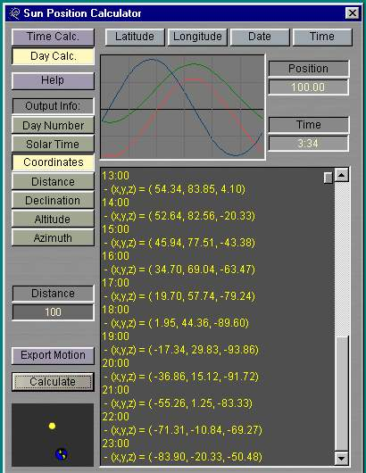



## Sun Position Calculator

### Description

Gives the Altitude and Azimuth angles of the sun at any time of the year, as well as giving the position in rectangular coordinates for use in positioning the sun in Lightwave. The program also creates a motion file that can be loaded into Lightwave to create animations involving the sun at a given location over a given period of time.
 
### More Info
 
This program may not work depending on the date format you have chosen in your Regional Settings in the Control Panel. I have only set it up for the two most common settings.

             |
---                |---
**Submitted On**   |2000-08-08 19:26:20
**By**             |[Sarah Mathiason](https://github.com/Planet-Source-Code/PSCIndex/blob/master/ByAuthor/sarah-mathiason.md)
**Level**          |Intermediate
**User Rating**    |4.6 (32 globes from 7 users)
**Compatibility**  |VB 6\.0
**Category**       |[Miscellaneous](https://github.com/Planet-Source-Code/PSCIndex/blob/master/ByCategory/miscellaneous__1-1.md)
**World**          |[Visual Basic](https://github.com/Planet-Source-Code/PSCIndex/blob/master/ByWorld/visual-basic.md)
**Archive File**   |[CODE\_UPLOAD8768882000\.zip](https://github.com/Planet-Source-Code/sarah-mathiason-sun-position-calculator__1-10537/archive/master.zip)

